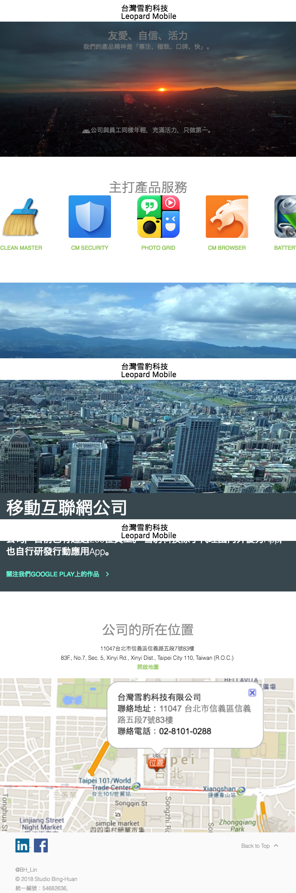

# 台灣雪豹科技 - Leopard Mobile

A modern, responsive company website for Taiwan Leopard Mobile Technology, showcasing mobile applications and services.

## 🌐 Live Website

**Website:** [http://binghuan.github.io/ileopard/](http://binghuan.github.io/ileopard/)

## 📱 About the Company

台灣雪豹科技 (Taiwan Leopard Mobile Technology) was founded in 2014 with the vision of becoming Taiwan's first true mobile internet company. The company now has over 200 employees and focuses on both developing original mobile applications and representing excellent domestic and international mobile apps.

### Company Values
- **友愛、自信、活力** (Friendship, Confidence, Vitality)
- **Product Philosophy:** 專注、極致、口碑、快 (Focus, Excellence, Reputation, Speed)

## 🚀 Featured Products

The website showcases our main mobile applications:

- **[Clean Master](https://www.cmcm.com/zh-tw/clean-master/)** - Mobile cleaning and optimization
- **[CM Security](https://www.cmcm.com/zh-tw/cm-security/)** - Mobile security solution
- **[Photo Grid](https://www.cmcm.com/zh-tw/photo-grid/)** - Photo editing and collage app
- **[CM Browser](https://www.cmcm.com/zh-tw/cm-browser/)** - Fast and secure mobile browser
- **Battery Doctor** - Battery optimization tool

## 🛠️ Technologies Used

- **HTML5** - Semantic markup
- **CSS3 & SCSS** - Modern styling with Material Design
- **Material Design Lite (MDL)** - Google's Material Design components
- **Material Icons** - Icon system
- **Roboto Font** - Typography
- **Responsive Design** - Mobile-first approach

## 📁 Project Structure

```
ileopard/
├── images/           # Company and product images
│   ├── andy.png     # Company mascot
│   ├── clean_master.png
│   ├── cm_security.png
│   ├── photo_grid.png
│   ├── cm_browser.png
│   ├── battery_doctor.png
│   └── ...
├── index.html       # Main website file
├── styles.css       # Custom styles
├── material.scss    # Material Design styles
└── README.md       # Project documentation
```

## 🏢 Company Information

**Address:** 
11047台北市信義區信義路五段7號83樓  
83F., No.7, Sec. 5, Xinyi Rd., Xinyi Dist., Taipei City 110, Taiwan (R.O.C.)

**Phone:** [02-8101-0288](tel:02-8101-0288)

**Business Registration:** 54682636

## 🔗 Social Media

- **LinkedIn:** [Leopard Mobile](https://www.linkedin.com/company/9549268)
- **Facebook:** [台灣雪豹科技](https://www.facebook.com/pages/%E5%8F%B0%E7%81%A3%E9%9B%AA%E8%B1%B9%E7%A7%91%E6%8A%80/449083778565495)
- **Google Play:** [Developer Profile](https://play.google.com/store/apps/dev?id=7480941732172192727)

## 📸 Demo

<table><tr><td>

</td></tr></table>

## 🚀 How to Run Locally

1. Clone the repository:
```bash
git clone https://github.com/binghuan/ileopard.git
cd ileopard
```

2. Open `index.html` in your web browser or serve it using a local server:
```bash
# Using Python
python -m http.server 8000

# Using Node.js
npx serve .
```

3. Navigate to `http://localhost:8000` in your browser


---

*Built with ❤️ by [@BH_Lin](https://github.com/binghuan)*
